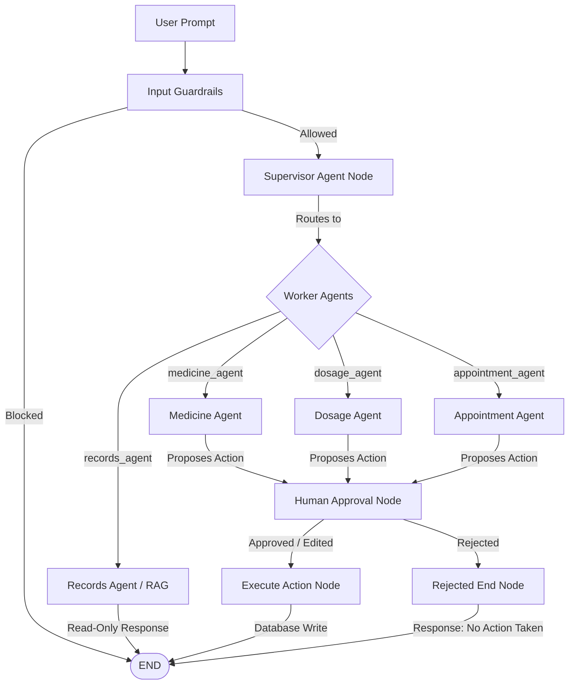

<div align="center">
  
  
  <h1>CarePilot AI 🧬</h1>
  <p><strong>The World's First Autonomous, Proactive Care Coordinator</strong></p>
  <p><em>CarePilot replaces passive health tracking with a team of specialized, safe-by-design AI agents that actively manage your health logistics.</em></p>
</div>

---

## 🚀 Why CarePilot?

Most "AI health assistant" demos are just chatbots wrapped around an LLM that answer generic questions. **CarePilot is entirely different.**

CarePilot acts as your **junior clinical administrator**. It doesn't just answer questions—it understands natural language requests, figures out exactly what systemic changes need to be made, and automatically orchestrates those changes across your health timeline. 

**Why not just use a Google Doc or a standard app?**
A Google Doc is passive. It won't remind you to take a missed dose, automatically decrement your physical pill supply, or intelligently summarize a 30-page PDF lab report. Standard medicine trackers require tedious manual data entry and lack context about your actual medical history. 

CarePilot acts as a **living, intelligent system**: you just tell it what changed in plain English, and it updates your structured data, monitors your supplies, extracts insights from uploaded records, and proactively prepares you for upcoming doctor visits. It turns passive record-keeping into active, intelligent care coordination.

**Crucially, CarePilot is Safe-by-Construction:** It physically cannot commit any changes to your health record without you clicking "Approve." This constraint is baked into the graph architecture, making it one of the only autonomous healthcare systems that is genuinely safe for production.

---

## ✨ Enterprise-Grade Features

*   **🎙️ Multi-Agent Orchestration**: Specialized AI agents for Medication, Dosages, Scheduling, and Medical Records. The system dynamically routes your intent to the correct specialist.
*   **🩺 Predictive Interaction Warnings**: Automatically cross-references new prescriptions against your existing stack, warning you of dangerous interactions (e.g., Metformin + Insulin risks) before they are saved.
*   **📊 Weekly Adherence Reports**: Automatically generates exportable, printable PDF reports of your adherence streaks to hand directly to your physician.
*   **👥 Caregiver / Family View**: Generate secure, read-only public timelines for family members to passively monitor your adherence and upcoming appointments without compromising account security.
*   **📄 AI Document Extraction**: Upload 50-page PDF lab reports. The system automatically processes, chunks, embeds, and extracts key insights (e.g., *“Cholesterol 210 mg/dL — up from 195”*) directly into your notification feed.
*   **🔄 Autonomous Refill Workflows**: When pill supplies drop below threshold, the system autonomously drafts pharmacy refill requests, transforming a multi-step chore into a single tap.
*   **⌚ Wearable Integration (Beta)**: Seamlessly mock-sync Apple Health / Fitbit data to correlate resting heart rate improvements directly with your medication adherence.

---

## 🏗️ Architecture & Safety

CarePilot is built on a cutting-edge **LangGraph** architecture with a strict **Human-in-the-Loop (HITL)** choke point.



**Security Guarantees:**
1. **MCP Tool Boundary**: Database writes go through explicit Model Context Protocol (MCP) tools.
2. **Topological Safety**: No worker agent has a direct edge to `execute_action`. An LLM going rogue cannot bypass the human approval gate because the graph topology physically prevents it.
3. **Pre-flight Guardrails**: Prompt-injection and clinical diagnosis requests are intercepted by a deterministic high-speed classifier before reaching the Supervisor.

---

## 💻 Quick Start

1. **Install dependencies and create a virtual environment:**
   ```bash
   python -m venv venv
   source venv/bin/activate
   pip install -r requirements.txt
   ```
2. **Configure Environment:**
   ```bash
   cp .env.example .env
   # Add DATABASE_URL, DATABASE_URL_SYNC, GROQ_API_KEY, JWT_SECRET_KEY
   ```
3. **Initialize the Vector Database:**
   ```bash
   createdb healthcare_ai
   alembic upgrade head
   ```
4. **Launch the Engine:**
   ```bash
   uvicorn app.main:app --reload --host 127.0.0.1 --port 8000
   ```
5. **Open** `http://127.0.0.1:8000` in your browser.

---

## 🌍 The Future of CarePilot

We aren't stopping here. Check out our [upcomingfeatures.md](upcomingfeatures.md) to see how we are integrating Realtime Voice Agents, Computer Vision Pill Identification, and automated Supply Chain logistics to define the next decade of digital health.
